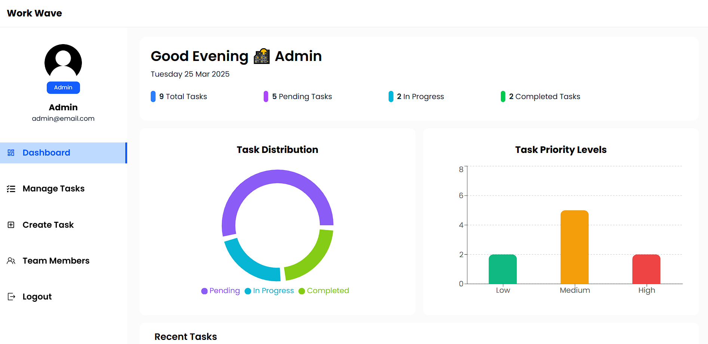
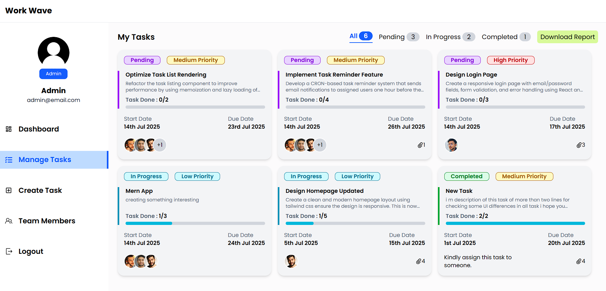
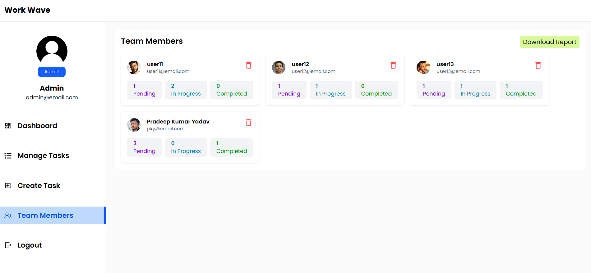
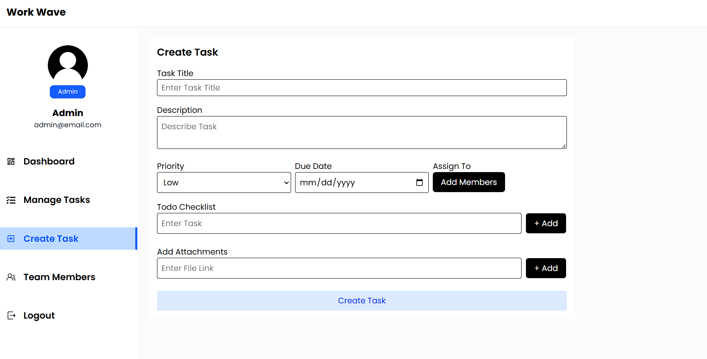
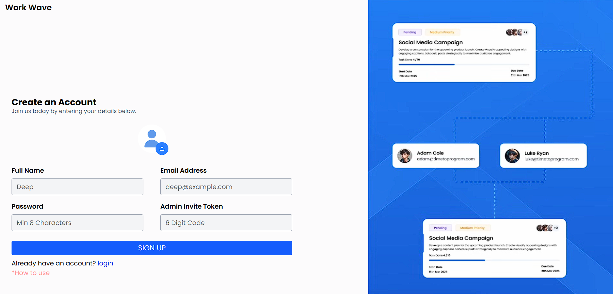

# 📋 WorkWave – Task Management System

**WorkWave** is a modern task management platform built for both **Admins** and **Users**. It allows administrators to efficiently assign, update, track, and report tasks, while users get a clear view of their responsibilities, progress, and deadlines — all in one responsive interface.

### 🔗 Live Demo
👉 [https://workwave247.vercel.app](https://workwave247.vercel.app)

---

## 🚀 Features

### 👨‍💼 For Admin
- Create, update, and delete tasks
- Assign tasks to individuals or groups
- Monitor task status: `Pending`, `In Progress`, `Completed`
- Export task reports in **Excel format** (with title, description, due date, assigned users, etc.)
- Export user report with their tasks and statuses

### 👨‍💻 For Users
- View assigned tasks with:
  - Title, Description, To-do List
  - Priority and Due Date
- Track status of tasks
- Organized, clutter-free interface

---

## ⚙️ Tech Stack

| Part         | Technology     |
|--------------|----------------|
| Frontend     | React.js       |
| Styling      | Tailwind CSS   |
| Backend      | Node.js        |
| Database     | MongoDB        |
| Hosting      | Vercel (Full Stack) |

---

## 💡 Purpose

WorkWave was designed to solve the problem of **disorganized task assignment and tracking** in teams. It enables managers to:
- Assign tasks efficiently
- Track progress with real-time status
- Export detailed reports for analysis
And it empowers users with a clear view of their work and responsibilities.

---

## 📸 Screenshots

> Replace the image paths below with your actual image file paths inside a `/screenshots` folder.

### 🏠 Dashboard

### 📋 Manage Task 

### 📊 Team Members

### 📋 Create Task

### 📊 Create Account

---